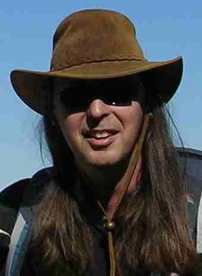

### Hi there 👋, I'm Roger

I'm a software engineer who likes working with Java and C++, and sometimes with Kotlin and Go.

My repositories include:

 - Madura framework: a rules based framework that uses rules to minimise writeing code.
 - Home automation: my home automation software using ESP8266 boards and a BeagleBone
 - Vortex Manipulator: a smart watch with extras
 
I'm currently working on a startup project which uses GKE, KeyCloak and KillBill.
